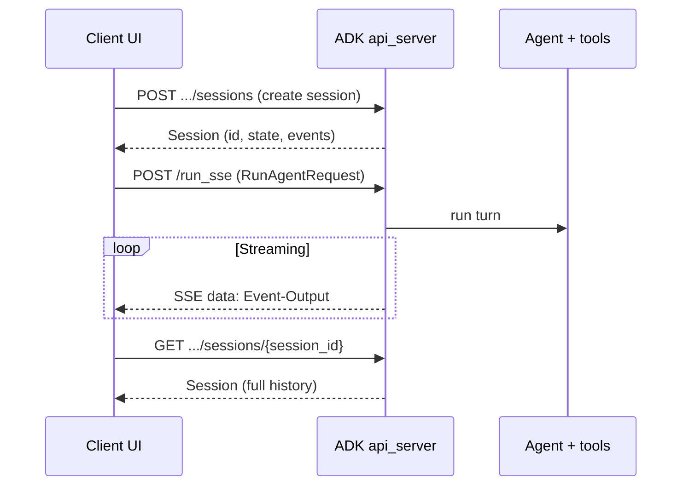

# FemVerse — Frontend integration (ADK API server)

This guide is for web and mobile engineers building a chat client against the Google ADK `api_server`. **Source of truth** for request and response shapes is the repo’s [`openapi.json`](../openapi.json) (generated from the ADK FastAPI app).

---

## 1. Overview

The ADK `api_server` exposes a REST API for **discovering apps**, **creating and managing sessions** (per-user conversation state + event history), **running the agent** (non-streaming or SSE), and **optional memory-bank updates**.

- **Default base URL:** `http://localhost:8000` (or whatever host/port the CLI prints).
- **Launch command** (from the repo root, matching [README.md](../README.md)):

  ```powershell
  adk api_server agent --session_service_uri="$env:SESSION_DB_URL" --memory_service_uri="agentengine://$env:AGENT_ENGINE_ID"
  ```

- **`app_name` in URLs:** use the same name you pass to the CLI as the app directory argument. In this repo that is **`agent`** (the `agent` package folder). Call `GET /list-apps` once to confirm in your environment.
- **Official docs:** [Agent Development Kit (ADK)](https://google.github.io/adk-docs/).

---

## 2. Conceptual model

| Concept | Meaning |
|--------|---------|
| **App** | A deployed ADK agent application (here, the FemVerse stack under the `agent` path). Identified by `app_name` in the path. |
| **`user_id`** | Your product’s stable user key. Sessions and memory are partitioned by this id. |
| **`session_id`** | One chat thread for that user. Holds **state** (key–value bag) and **events** (append-only conversation log). |
| **Event** | One unit in the transcript: user message, model chunk, tool call, etc. The API returns **`Event-Output`** objects in history and SSE streams. |
| **Memory** | Long-term store (Vertex Memory Bank when configured). Optional `PATCH .../memory` pushes a finished session; this project also uses an `after_agent_callback` for related behavior. |



---

## 3. Authentication and CORS

- By default the ADK **`api_server` has no application-level auth**. Treat it as an internal service or put it behind your **API gateway** (JWT, mTLS, etc.).
- **CORS:** configure allowed browser origins via the CLI (e.g. `--allow_origins`) when you need a web app on another origin to call the API directly.

---

## 4. End-to-end flow (happy path)

1. **Discover app** — `GET /list-apps` → confirm `app_name` (expect `agent` in this layout).
2. **Create session** — `POST /apps/{app_name}/users/{user_id}/sessions` with optional `CreateSessionRequest`, or `POST .../sessions/{session_id}` for a **fixed id** (resumable tabs).
3. **Send a message (streaming)** — `POST /run_sse` with `RunAgentRequest` (`newMessage`, `streaming: true`, optional `stateDelta`).
4. **Render** — parse SSE lines; append `content.parts[].text` when `partial` is true; finalize the bubble when `turnComplete` or `partial` is false/absent on the last event for the turn.
5. **Persist UI-only state** — store `user_id`, `session_id`, and sidebar metadata in your app; session **state** and **events** live on the server.
6. **Resume on reload** — `GET .../sessions/{session_id}` to rebuild the transcript; continue with `POST /run_sse` using the same ids.

---

## 5. Endpoint reference

Unless noted, send **`Content-Type: application/json`**. Path parameters use snake_case in the OpenAPI paths (`app_name`, `user_id`, `session_id`).

### 5.1 `GET /list-apps`

**Query:** optional `detailed` (boolean).

**Response:** JSON array of app name strings, or a detailed object per OpenAPI `anyOf`.

```bash
curl -s "http://localhost:8000/list-apps"
```

---

### 5.2 `POST /apps/{app_name}/users/{user_id}/sessions`

**Create session** with server-generated id unless you supply `sessionId` in the body.

**Request body:** optional `CreateSessionRequest`:

| Field | Type | Notes |
|-------|------|--------|
| `sessionId` | string \| null | Omit for auto id. |
| `state` | object \| null | Initial session state. |
| `events` | array of `Event-Input` \| null | Rare for clients; seed history if needed. |

**Response:** `Session` (see appendix).

```bash
curl -s -X POST "http://localhost:8000/apps/agent/users/usr_8421/sessions" \
  -H "Content-Type: application/json" \
  -d "{\"state\": {\"language\": \"en\"}}"
```

---

### 5.3 `POST /apps/{app_name}/users/{user_id}/sessions/{session_id}`

**Create session with a specific id** (idempotent pattern for “resume this tab”).

**Request body:** optional arbitrary JSON object (OpenAPI: `State` — additional properties) or `null` for default empty state.

**Response:** `Session`.

```bash
curl -s -X POST "http://localhost:8000/apps/agent/users/usr_8421/sessions/sess_2026_05_13_001" \
  -H "Content-Type: application/json" \
  -d "{\"language\": \"Urdu\"}"
```

---

### 5.4 `GET /apps/{app_name}/users/{user_id}/sessions/{session_id}`

**Fetch full session:** state + events + metadata.

**Response:** `Session`.

```bash
curl -s "http://localhost:8000/apps/agent/users/usr_8421/sessions/sess_2026_05_13_001"
```

---

### 5.5 `GET /apps/{app_name}/users/{user_id}/sessions`

**List sessions** for a user (sidebar).

**Response:** `Session[]`.

```bash
curl -s "http://localhost:8000/apps/agent/users/usr_8421/sessions"
```

---

### 5.6 `PATCH /apps/{app_name}/users/{user_id}/sessions/{session_id}`

**Update session state without running the agent** (e.g. set `language` mid-chat).

**Request body:** `UpdateSessionRequest`:

| Field | Type | Required |
|-------|------|----------|
| `stateDelta` | object | yes — merged into session state before the next agent run |

**Response:** `Session`.

```bash
curl -s -X PATCH "http://localhost:8000/apps/agent/users/usr_8421/sessions/sess_2026_05_13_001" \
  -H "Content-Type: application/json" \
  -d "{\"stateDelta\": {\"language\": \"Urdu\"}}"
```

---

### 5.7 `DELETE /apps/{app_name}/users/{user_id}/sessions/{session_id}`

**Delete session** (clear a chat).

**Response:** empty JSON object per spec.

```bash
curl -s -X DELETE "http://localhost:8000/apps/agent/users/usr_8421/sessions/sess_2026_05_13_001"
```

---

### 5.8 `POST /run`

**Non-streaming** agent run.

**Request body:** `RunAgentRequest` (see §6).

**Response:** JSON array of `Event-Output`.

```bash
curl -s -X POST "http://localhost:8000/run" \
  -H "Content-Type: application/json" \
  -d "{\"appName\":\"agent\",\"userId\":\"usr_8421\",\"sessionId\":\"sess_2026_05_13_001\",\"newMessage\":{\"role\":\"user\",\"parts\":[{\"text\":\"Summarize my last question in one line.\"}]},\"streaming\":false}"
```

---

### 5.9 `POST /run_sse`

**Streaming** agent run (**Server-Sent Events**). This is the primary endpoint for interactive chat.

**Request body:** same `RunAgentRequest` as `/run`. Set `"streaming": true` in the body for clarity (the stream is implied by the endpoint).

**Response:** `text/event-stream` — each SSE message payload is one **`Event-Output`** JSON object (see §6).

```bash
curl -N -X POST "http://localhost:8000/run_sse" \
  -H "Content-Type: application/json" \
  -H "Accept: text/event-stream" \
  -d "{\"appName\":\"agent\",\"userId\":\"usr_8421\",\"sessionId\":\"sess_2026_05_13_001\",\"newMessage\":{\"role\":\"user\",\"parts\":[{\"text\":\"I think my cycle is delayed\"}]},\"streaming\":true,\"stateDelta\":{\"language\":\"Urdu\"}}"
```

---

### 5.10 `PATCH /apps/{app_name}/users/{user_id}/memory`

**Push a finished session into the memory service** (optional; Memory Bank must be configured).

**Request body:** `UpdateMemoryRequest`:

| Field | Type | Required |
|-------|------|----------|
| `sessionId` | string | yes |

```bash
curl -s -X PATCH "http://localhost:8000/apps/agent/users/usr_8421/memory" \
  -H "Content-Type: application/json" \
  -d "{\"sessionId\": \"sess_2026_05_13_001\"}"
```

---

## 6. Streaming a message (chat core)

### 6.1 `RunAgentRequest` body (camelCase)

| Field | Type | Required | Notes |
|-------|------|----------|--------|
| `appName` | string | yes | e.g. `agent` |
| `userId` | string | yes | |
| `sessionId` | string | yes | |
| `newMessage` | `Content` \| null | no | User turn to append |
| `streaming` | boolean | no | default `false` |
| `stateDelta` | object \| null | no | Merged into session state **before** this run |
| `functionCallEventId` | string \| null | no | Advanced |
| `invocationId` | string \| null | no | Advanced |

Example:

```json
{
  "appName": "agent",
  "userId": "usr_8421",
  "sessionId": "sess_2026_05_13_001",
  "newMessage": {
    "role": "user",
    "parts": [{ "text": "I think my cycle is delayed" }]
  },
  "streaming": true,
  "stateDelta": { "language": "Urdu" }
}
```

### 6.2 SSE format

- Lines follow the SSE convention: `data: `<JSON>`\n\n` repeated.
- Each JSON object is an **`Event-Output`**.

**UI-oriented fields:**

| Field | Why it matters |
|-------|----------------|
| `content.parts[].text` | Token or segment of assistant text (when present). |
| `partial` | `true` on streaming chunks; `false` or absent on final segments. |
| `turnComplete` | `true` when the model finished a turn — good signal to stop spinners and commit the assistant message. |

**Pitfall:** browser `EventSource` only supports **GET**. For `POST /run_sse` use **`fetch` + `ReadableStream`** (or a small wrapper).

### 6.3 Plain JavaScript: async iterator over SSE

```javascript
async function* parseSseJsonLines(body) {
  const reader = body.getReader();
  const decoder = new TextDecoder();
  let buf = "";
  while (true) {
    const { value, done } = await reader.read();
    if (done) break;
    buf += decoder.decode(value, { stream: true });
    let idx;
    while ((idx = buf.indexOf("\n\n")) >= 0) {
      const raw = buf.slice(0, idx).trimEnd();
      buf = buf.slice(idx + 2);
      for (const line of raw.split("\n")) {
        if (line.startsWith("data:")) {
          const json = line.slice(5).trim();
          if (json && json !== "[DONE]") yield JSON.parse(json);
        }
      }
    }
  }
}
```

### 6.4 Non-streaming recap

Use **`POST /run`** with the same `RunAgentRequest` and `"streaming": false` (or omit). The response is a **single JSON array** of `Event-Output` — convenient for batch jobs, summarization, or tests.

---

## 7. Reading chat history

`GET .../sessions/{session_id}` returns:

```json
{
  "id": "…",
  "appName": "agent",
  "userId": "usr_8421",
  "state": { },
  "events": [ /* Event-Output */ ],
  "lastUpdateTime": 0
}
```

**Transcript rules:**

- Skip or hide events whose `content.parts` are **tool** payloads: parts with **`functionCall`** or **`functionResponse`** (no user-visible `text`).
- Prefer parts with **`text`** for the chat bubble.
- Use **`author`** to distinguish **user** vs **model** / specialist name (e.g. `menstrual_specialist`). `content.role` is `"user"` or `"model"` when set.

**Reduce to `{ role, text }[]` (illustrative):**

```javascript
function transcriptFromSession(session) {
  return (session.events || []).flatMap((ev) => {
    const parts = ev.content?.parts || [];
    if (parts.some((p) => p.functionCall || p.functionResponse)) return [];
    const text = parts.map((p) => p.text).filter(Boolean).join("");
    if (!text) return [];
    const role = ev.author === "user" ? "user" : "assistant";
    return [{ role, text }];
  });
}
```

---

## 8. Listing user sessions

`GET /apps/{app_name}/users/{user_id}/sessions` returns **`Session[]`**.

- Sort by **`lastUpdateTime`** descending for a recency-ordered sidebar.
- **Preview title:** scan each session’s `events` for the first user message with a `text` part and use a truncated string.

---

## 9. Per-turn metadata via `stateDelta`

`stateDelta` on **`/run`** / **`/run_sse`** is merged into session state **before** the model runs this turn.

| Key | Use |
|-----|-----|
| `language` | e.g. `"Urdu"` — specialists read session state in this project. |
| `topic_override` | Force routing when you add such logic (rare). |
| `client_ts`, `device`, etc. | Safe to stash for analytics; agents typically ignore unknown keys. |

You can also **`PATCH`** the session (§5.6) to change state **without** invoking the model.

---

## 10. Error handling

| Status | Meaning | What to do |
|--------|---------|------------|
| **422** | Request validation (FastAPI / Pydantic). | Inspect JSON body (`detail`); fix shapes (wrong types, missing `stateDelta` on PATCH, bad enums). |
| **404** | Unknown `app_name`, user, or session (when the server maps missing rows to 404). | Re-create session or refresh app list. |
| **500** | Server or agent failure (tools, callbacks, model). | Log correlation id if present; check **server logs**; retry idempotently for reads, not blindly for pays. |

**Examples that often cause 422:**

- `PATCH .../sessions/...` without **`stateDelta`**.
- Malformed `newMessage` (e.g. `parts` not an array).
- Invalid JSON or wrong Content-Type.

---

## 11. Appendix — core JSON schemas

Collapsed from `openapi.json` with one-line field notes. For the full graph (`GroundingMetadata`, `FunctionCall`, …) see the OpenAPI file.

### `Content`

```json
{
  "type": "object",
  "additionalProperties": false,
  "properties": {
    "parts": { "title": "Parts", "description": "Message parts; may mix MIME types / modalities." },
    "role": { "title": "Role", "description": "'user' or 'model'; service may default to 'user'." }
  },
  "title": "Content"
}
```

### `Part` (summary)

Object with optional keys among: `text`, `functionCall`, `functionResponse`, `inlineData`, `fileData`, `executableCode`, `codeExecutionResult`, `thought`, `thoughtSignature`, `mediaResolution`, … — see `#/components/schemas/Part` in OpenAPI.

### `RunAgentRequest`

```json
{
  "type": "object",
  "properties": {
    "appName": { "type": "string", "title": "Appname" },
    "userId": { "type": "string", "title": "Userid" },
    "sessionId": { "type": "string", "title": "Sessionid" },
    "newMessage": { "anyOf": [{ "$ref": "#/components/schemas/Content" }, { "type": "null" }] },
    "streaming": { "type": "boolean", "title": "Streaming", "default": false },
    "stateDelta": { "anyOf": [{ "type": "object", "additionalProperties": true }, { "type": "null" }] },
    "functionCallEventId": { "anyOf": [{ "type": "string" }, { "type": "null" }] },
    "invocationId": { "anyOf": [{ "type": "string" }, { "type": "null" }] }
  },
  "required": ["appName", "userId", "sessionId"],
  "title": "RunAgentRequest"
}
```

### `Session`

```json
{
  "type": "object",
  "additionalProperties": false,
  "properties": {
    "id": { "type": "string", "title": "Id" },
    "appName": { "type": "string", "title": "Appname" },
    "userId": { "type": "string", "title": "Userid" },
    "state": { "type": "object", "additionalProperties": true, "title": "State" },
    "events": { "type": "array", "items": { "$ref": "#/components/schemas/Event-Output" }, "title": "Events" },
    "lastUpdateTime": { "type": "number", "title": "Lastupdatetime", "default": 0 }
  },
  "required": ["id", "appName", "userId"],
  "title": "Session"
}
```

### `Event-Output` (structural core)

Required: **`author`** (string). Common optional fields include:

- `content` → `Content`
- `partial`, `turnComplete`, `interrupted` (booleans)
- `finishReason`, `errorCode`, `errorMessage`
- `invocationId`, `id`, `timestamp`, `modelVersion`
- `usageMetadata`, `citationMetadata`, `groundingMetadata`, …

Full definition: `#/components/schemas/Event-Output` in OpenAPI (large union of optional telemetry).

### `UpdateMemoryRequest`

```json
{
  "type": "object",
  "properties": {
    "sessionId": { "type": "string", "title": "Sessionid" }
  },
  "required": ["sessionId"],
  "title": "UpdateMemoryRequest",
  "description": "Request to add a session to the memory service."
}
```

### `UpdateSessionRequest`

```json
{
  "type": "object",
  "properties": {
    "stateDelta": { "type": "object", "additionalProperties": true, "title": "Statedelta" }
  },
  "required": ["stateDelta"],
  "title": "UpdateSessionRequest",
  "description": "Request to update session state without running the agent."
}
```

### `CreateSessionRequest`

```json
{
  "type": "object",
  "properties": {
    "sessionId": { "anyOf": [{ "type": "string" }, { "type": "null" }], "description": "If omitted, random id." },
    "state": { "anyOf": [{ "type": "object", "additionalProperties": true }, { "type": "null" }] },
    "events": { "anyOf": [{ "type": "array", "items": { "$ref": "#/components/schemas/Event-Input" } }, { "type": "null" }] }
  },
  "title": "CreateSessionRequest"
}
```

---

## 12. Minimal reference client (TypeScript)

Starting point only — no framework, **fetch + stream** for SSE. Adjust `APP` to match `list-apps`.

```typescript
// femverseClient.ts — minimal ADK chat client (starting point)
const APP = "agent";

export async function createSession(
  base: string,
  userId: string,
  body: Record<string, unknown> = {}
) {
  const r = await fetch(`${base}/apps/${APP}/users/${userId}/sessions`, {
    method: "POST",
    headers: { "Content-Type": "application/json" },
    body: JSON.stringify(body),
  });
  if (!r.ok) throw new Error(await r.text());
  return r.json() as Promise<{ id: string }>;
}

export async function* streamMessage(
  base: string,
  req: Record<string, unknown>
) {
  const r = await fetch(`${base}/run_sse`, {
    method: "POST",
    headers: { "Content-Type": "application/json", Accept: "text/event-stream" },
    body: JSON.stringify({ ...req, appName: APP, streaming: true }),
  });
  if (!r.ok || !r.body) throw new Error(await r.text());
  const rd = r.body.getReader();
  const dec = new TextDecoder();
  let buf = "";
  for (;;) {
    const { value, done } = await rd.read();
    if (done) break;
    buf += dec.decode(value, { stream: true });
    let i: number;
    while ((i = buf.indexOf("\n\n")) >= 0) {
      const block = buf.slice(0, i).trimEnd();
      buf = buf.slice(i + 2);
      for (const line of block.split("\n")) {
        if (!line.startsWith("data:")) continue;
        const j = line.slice(5).trim();
        if (j && j !== "[DONE]") yield JSON.parse(j);
      }
    }
  }
}

export function getHistory(base: string, userId: string, sessionId: string) {
  return fetch(`${base}/apps/${APP}/users/${userId}/sessions/${sessionId}`).then((r) => {
    if (!r.ok) throw new Error(await r.text());
    return r.json();
  });
}

export function listSessions(base: string, userId: string) {
  return fetch(`${base}/apps/${APP}/users/${userId}/sessions`).then((r) => {
    if (!r.ok) throw new Error(await r.text());
    return r.json();
  });
}

export function deleteSession(base: string, userId: string, sessionId: string) {
  return fetch(`${base}/apps/${APP}/users/${userId}/sessions/${sessionId}`, {
    method: "DELETE",
  }).then((r) => {
    if (!r.ok) throw new Error(await r.text());
  });
}
```
